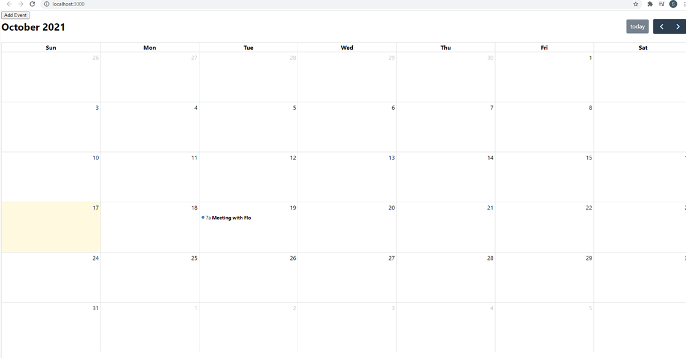

# Scheduler-React

A full-stack MERN project created to server as a calendar/scheduler using react, node, express, and mongoDB.
The project allows the user to add and store meetings by time and date.

To view the page, please select the link below.

https://.netlify.app/

